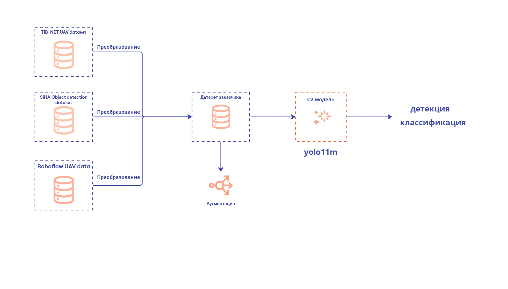
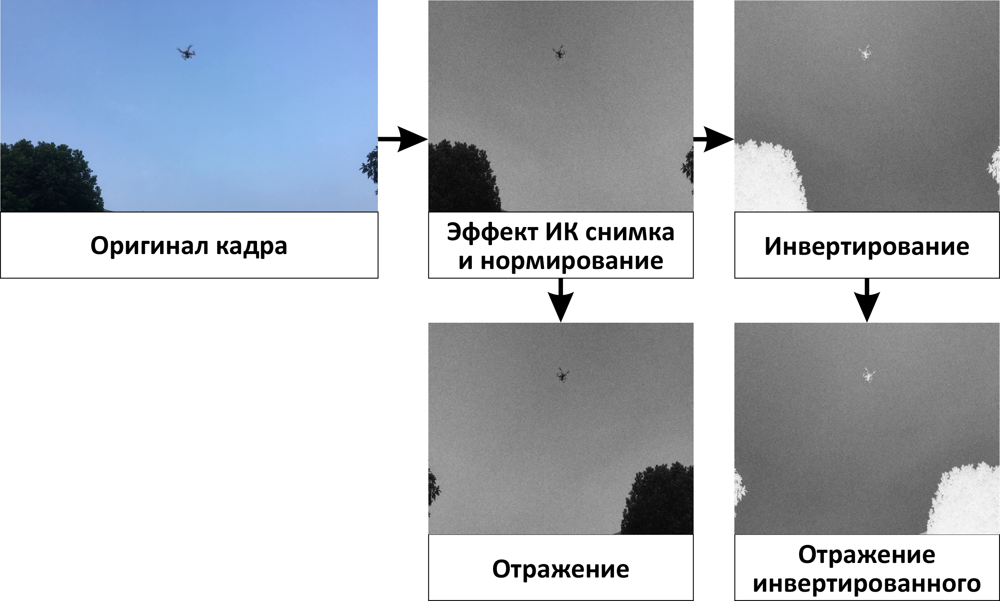

# Решение команды model.fit в кейсе от Минпромторга "Обнаружение воздушных объектов с помощью анализа видеоинформации"

## Архитектура решения

* Данные кейсодержателя расширены за счет добавления 3 датасетов. Суммарно данные обогатились на 19000 изображений.
* Все дополнительные данные размечены вручную с помощью roboflow
* Часть данных кейсодержателя аугментирована за счет увеличения и растяжения областей, содержащих таргетный обьект.
* Дообучена модель yolo11m на задачу детекции и бинарной классификации.

### Преобразование изображений сторонних датасетов


### Структура проекта
```
├── app.py # небольшой веб-интерфейс для визуализации видеопотока на основе streamlit
├── inference.py # ручной инференс обученной модели
├── README.md
├── requirements.txt
└── submit_proceeding.py # скрипт для создания сабмита
Оставшиеся .py файлы содержат различные полезные функции для обработки изображений.
```

0. Установите зависимости

```
pip install -r requirements.txt
```

1. Создайте виртуальное окружение `.env` в папке с проектом


2. Выберите модель finetuned_yolo11s.pt из /models в app.py
3. Запустите app.py. **Note**:
 streamlit run app.py
